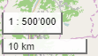

# Massstab-Werkzeug auf der Karte

Wurde am 14.09.2018 eingeführt.

Ihr findet es unten links auf der Karte, oberhalb des Werkzeugs, dass eine Distanz anzeigt.

Was kann es?

- Es zeigt immer den ungefähren aktuellen Massstab der Karte an 
  Wieso ungefähr?
    - Es wird der nächste Massstab aus der Auswahlliste angezeigt (siehe unten)
    - Weil der Massstab von sehr vielen Faktoren abhängt (u.a. Tile-Grösse der Hintergrundkarte, geographische Höhe, Bildschirm-Auflösung...) ist er grundsätzlich nicht sehr genau.
    - Plane Kartendarstellungen können grundsätzlich nicht überall denselben Massstab darstellen. Versucht mal, einen aufblasbaren Globus aufzuschneiden und flach auszubreiten...
- Klickt man drauf, öffnet sich eine Liste von Massstäben, aus denen man wählen kann
- ...und im untersten Feld kann man einen beliebigen Massstab setzen