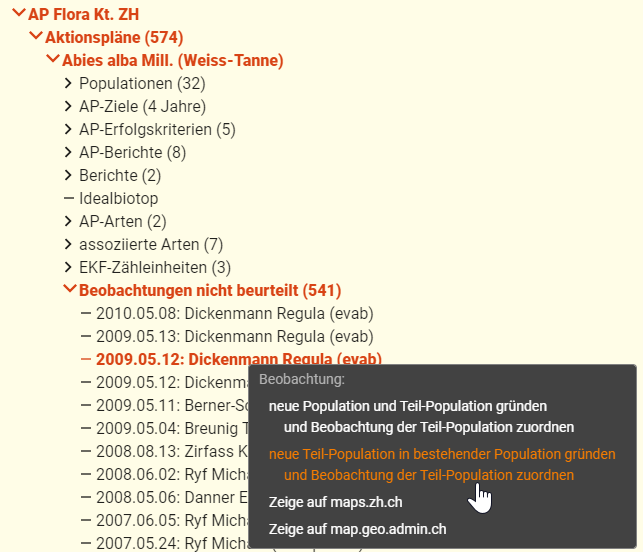

Bei den wichtigsten Artförderprogrammen werden gemeldete Beobachtungen beurteilt. Sie werden entweder verworfen ("nicht zuordnen") oder einer Teilpopulation zugeordnet.  

Verworfen werden Beobachtungen in der Regel, wenn:
- sie nicht (genau genug) lokalisiert werden können oder
- die Artbestimmung (zu) unsicher ist

## 1. So wird's gemacht
### 1.1 Im Formular

1. Aktionsplan wählen
2. Im Strukturbaum eine nicht beurteilte Beobachtung wählen
3. Im Formular bei "Einer Teilpopulation zuordnen" die gewünschte wählen  

### 1.2 in Karten
Gemäss diesem Video:
`youtube: https://www.youtube.com/watch?v=Oy-TDV37xhI&list=PLTz8Xt5SOQPS-dbvpJ_DrB4-o3k3yj09J&index=8`

### 1.3 Im Strukturbaum
Hier gibt es zwei Methoden, die mit einem einzigen Klick ausgelöst werden können:
- neue Population und Teil-Population gründen und die Beobachtung der neuen Teil-Population zuordnen
- neue Teil-Population in bestehender Population gründen und die Beobachtung der neuen Teil-Population zuordnen. 
  Die gewünschte Population kann aus einer Liste gewählt werden

 

## 2. Verfügbare Beobachtungen

- Im September 2017 wurden zuletzt alle Beobachtungen der [Info Spezies](https://www.infoflora.ch/de/allgemeines/info-species.html) und der Fachstelle Naturschutz für den Kanton Zürich integriert
- Im April 2017 wurden die Beobachtungen des Projekts [Floz](https://www.floz.zbg.ch/) integriert