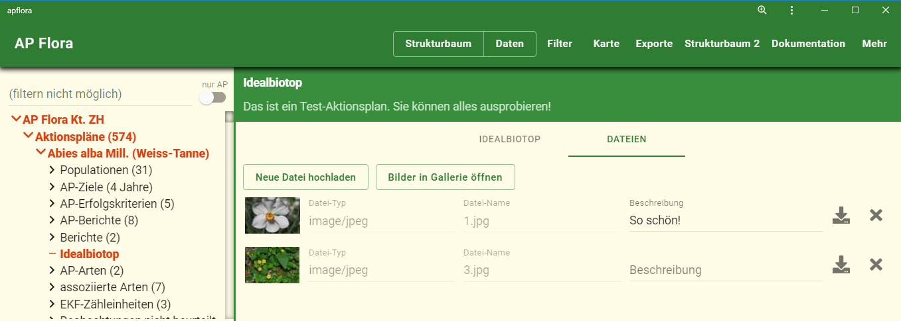
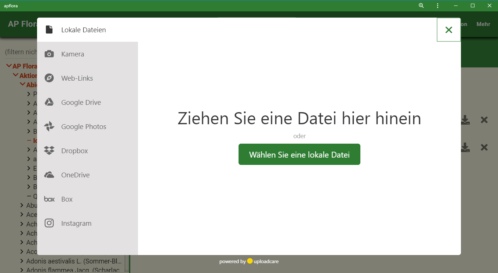
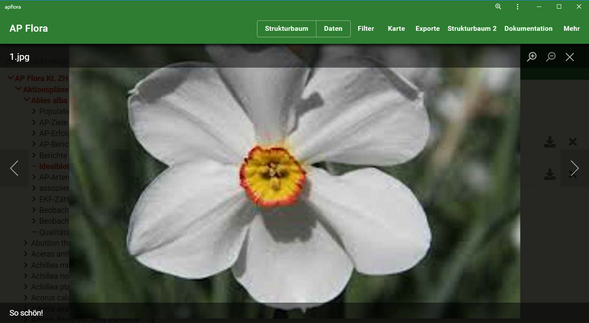
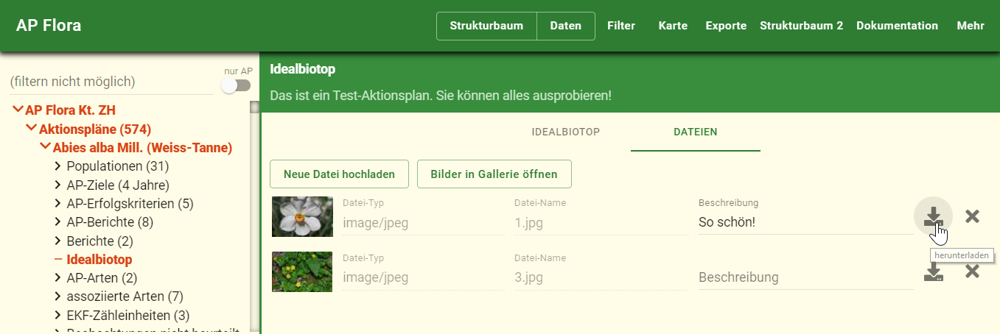

Wurde am 27.05.2019 eingeführt.  

Dateien können **in folgenden Formularen** angefügt werden:
- Idealbiotop: Im neuen Reiter "Dateien"
- Feld-Kontrolle: Im neuen Reiter "Dateien"
- Freiwilligen-Kontrolle: Im neuen Bereich "Dateien". Er ist nur im Formular sichtbar, wird also nicht gedruckt.

Beispiel Idealbiotop:
 

**Zweck**: Idealbiotope und Kontrollen gemäss Vorgaben von Topos dokumentieren. Daher jede Datei ein Feld, um sie zu beschreiben.  

**Hochladen** könnt ihr aus folgenden Quellen:
- Lokal: Eine auf eurem PC gespeicherte Datei
- Kamera: Direkt von der Kamera (z.B. wenn ihr das direkt im Feld auf dem Smartphone macht)
- Web-Links
- Google Drive
- Google Photos
- Dropbox
- OneDrive
- box
- Instagram

Hochladen-Dialog:
 

Meist dürfte es sich um Bilder handeln. Daher gibt es auch eine Möglichkeit, die Bilder inklusive Beschreibung in einer **Gallerie-Ansicht** zu öffnen:
 

Ihr könnt Dateien auch **herunterladen**:
 

**Bitte mit Bedacht nutzen**:
- Möglichst nur hochladen, was nützlich ist 
- Speicherplatz hat seinen Preis
- Grössere Bilder werden daher beim Upload auf maximal 2056*2056 Pixel reduziert
- Maximale Datei-Grösse ist 100MB