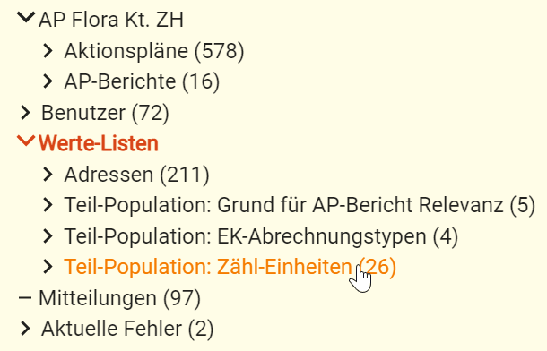
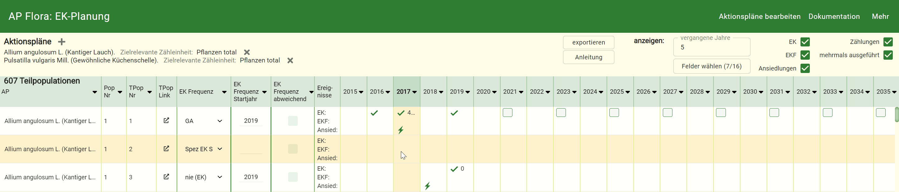
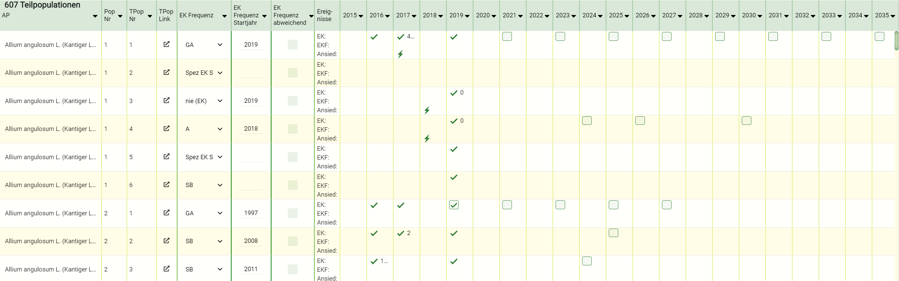
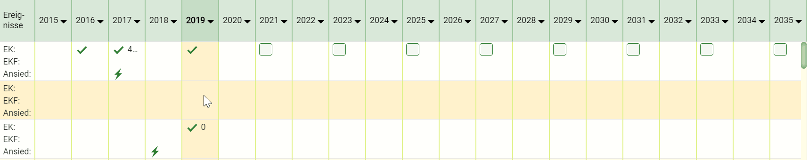
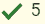
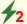
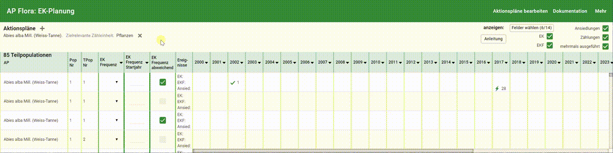
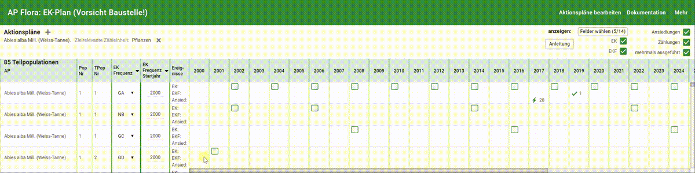

**Inhalt** 

1. [Ziele](#1-ziele)
1. [Diese Daten werden erfasst](#2-diese-daten-werden-erfasst)
   - [Global](#global)
   - [Pro Art](#pro-art)
   - [Pro Teilpopulation](#pro-teilpopulation)
1. [Formular EK-Planung](#3-formular-ek-planung)
   - [Arten wählen](#arten-wählen)
   - [Dargestellte Informationen wählen](#dargestellte-informationen-wählen)
   - [Kontrollen planen](#kontrollen-planen)
   - [Mehr Informationen](#mehr-informationen)
   - [Filter setzen](#filter-setzen)
       

## 1. Ziele

Erfolgskontrollen sind gleichzeitig wichtig und aufwändig. Im Jahr 2019 wird die Verwaltung und Planung der eigentlichen Kontrollen in apflora weiter entwickelt. Ziele:

- Die Durchführung von Erfolgskontrollen kann sorgfältig geplant werden
- Topos und Artverantwortliche erhalten eine gute Übersicht über:
  - geplante EK und EKF
  - durchgeführte EK und EKF
  - Ansiedlungen
- Es wird sicher gestellt, dass für jede Art die zielrelevanten Einheiten gezählt und dokumentiert werden

## 2. Diese Daten werden erfasst

### Global

Durch die Koordinationsstelle. Im Strukturbaum in den Werte-Listen.

- EK-Abrechnungstypen
- Zähleinheiten
  

### Pro Art

Durch Koordinationsstelle und Artverantwortliche.

- Welche Zähleinheiten sind zielrelevant und sollen daher immer erfasst werden
- Frequenzen, nach denen in dieser Art kontrolliert werden soll. Inklusive Abrechnungstyp (EK-Frequenzen)
  

### Pro Teilpopulation

Durch Artverantwortliche.

- Aus den für die Art bestimmten Frequenzen wird die für diese Teil-Population passende gewählt
- Weicht die EK-Frequenz von der auf Art-Ebene für diesen Fall bestimmten Wert ab, wird das besonders markiert ("EK-Frequenz abweichend")
- In welchen Jahren Kontrollen erfolgen sollen, differenziert nach EK und EKF

Letzteres ist die eigentliche EK-Planung und sie geschieht primär im entsprechenden Formular:  

## 3. Formular EK-Planung

Das Formular ist für die Darstellung und Bearbeitung grosser Datenmengen konzipiert. 
Je grösser und höher aufgelöst der Bildschirm, desto übersichtlicher kann man arbeiten. Auf kleinen Bildschirmen (z.B. Handy) ist es kaum brauchbar.  

### Arten wählen

Oben links wählt man, von welchen Arten Teil-Populationen angezeigt werden sollen: 
 

Sobald eine Art gewählt wurde, erscheinen die zugehörigen Teil-Populationen in der Liste. 
 
Klickt man auf einen Spaltenkopf eines Felds, dass die Teil-Population beschreibt, erscheint eine Filter-Menu: 
  

Rechts davon werden für Jahre Spalten aufgebaut: 
 
Je nachdem, welcher Wert oben rechts im Feld "vergangene Jahre" gewählt wurde (voreingestellt sind 5), werden die Jahre von diesem Wert bis 15 Jahre in die Zukunft angezeigt. 
Auch wenn man für "vergangene Jahre" sehr hohe Werte wählt, wird frühestens mit dem ersten Jahr begonnen, in dem in einer der aufgelisteten Teil-Populationen eine Kontrolle stattfand.   

### Dargestellte Informationen wählen

Oben rechts wählt man, welche Informationen in den Teil-Populationen angezeigt werden: 
 

In den Zeilen für die Teilpopulationen werden in den Jahres-Spalten dargestellt:

- Grüne Haken symbolisieren ausgeführte Kontrollen 
- Direkt rechts des Hakens stellt eine rote Zahl die Anzahl Kontrollen dar, wenn im selben Jahr mehrere Kontrollen stattfanden 
- Etwas weiter rechts neben dem Haken stellt eine schwarze Zahl die gemäss zielrelevanter Zähleinheit erfasste Anzahl dar, wenn diese Einheit gezählt wurde 
- Grüne Quadrate symbolisieren geplante Kontrollen 
- Fand eine Kontrolle im geplanten Jahr statt, sieht man im grünen Quadrat den grünen Haken 
- Grüne Blitze symbolisieren Ansiedlungen 
- Direkt rechts des Blitzes erscheint eine rote Zahl, wenn im selben Jahr mehrere Ansiedlungen stattfanden. Sie stellt die Anzahl Ansiedlungen dar 
- Etwas weiter rechts neben dem Blitz stellt eine schwarze Zahl die Anzahl Planzen und Triebe dar, falls erfasst 

### Kontrollen planen

#### Automatisch

Ändert man die EK-Frequenz: 

1. Setzt apflora zunächst das Startjahr, beruhend auf der gewählten EK-Frequenz mit:

- EK-Typ (EK oder EKF)
- "Kontrolljahre ab letzter" (Kontrolle oder Ansiedlung)
- letzte Kontrolle oder Ansiedlung

2. Dann setzt apflora die EK-Pläne, beruhend auf

- Startjahr und
- Kontrolljahre gemäss EK-Frequenz 

Ändert man das Startjahr (und es gibt eine EK-Frequenz), setzt apflora die EK-Pläne.  

#### Manuell

Wenn man eine Jahres-Zelle (Teilpopulation in Jahr) mit der Linken Maustaste anklickt, erscheint ein Menü. Hier wählt man den entsprechenden Eintrag:
 

### Mehr Informationen

Im gleichen Menü findet man weiterführende Infos zu EK, EKF und Ansiedlungen sowie Links um sie zu öffnen: 
 

### Filter setzen

Bei den Feldern "EK-Frequenz" und "EK-Frequenz Startjahr" kann nach Nullwerten gefiltert werden: 
 

In den Jahres-Spalten kann nach dem Vorhandensein von Kontrollen, EK-Plänen und Ansiedlungen gefiltert werden: 

