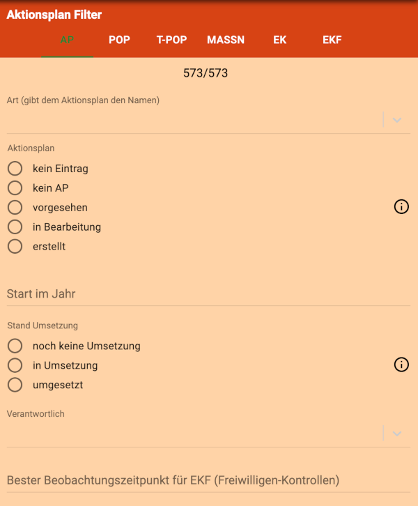
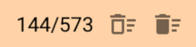
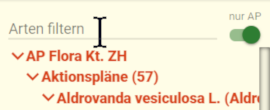

Am 12.09.2018 wurden Formular-Filter eingeführt. 
Am 15.03.2019 wurden sie verändert, um die Benutzerfreundlichkeit zu erhöhen. 
 

## In diesen Formularen kann man filtern
- Aktionsplan
- Population
- Teil-Population
- Massnahmen
- Feld-Kontrollen
- Freiwilligen-Kontrollen (nur in der Normal-Ansicht. Freiwillige können das also nicht)

Die Filter-Formulare entsprechen (fast) genau den normalen Formularen. Sie sind aber rot hinterlegt, damit nicht aus Versehen echte Daten verändert werden.

Erfasst man in einem Filter-Feld Daten, wird der entsprechende Filter nach Verlassen des Feldes oder nach Drücken der Enter-Taste angewendet (bei Auswahl-Feldern sofort).

Filtern kann man im `Strukturbaum` _und_ im `Strukturbaum 2`. Öffnet man den `Strukturbaum 2`, entspricht er genau dem `Strukturbaum`, d.h. es wird auch ein allfälliger Filter kopiert. Danach sind die Filter unabhängig.  

## Wie öffnet man ein Filter-Formular?
- Mit der Schaltfläche oben in der Navigationszeile, rechts neben der Daten-Schaltfläche 
  

## Wo wird der Filter angewendet?
- Im Strukturbaum auf der gefilterten Ebene. 
  Ein Filter auf Ebene Teil-Population wirkt sich also nicht auf die Populationen aus
- In der Karte (Populationen, Teil-Populationen). 
  Ein Filter auf Ebene Teil-Population wirkt sich hier auch auf der Ebene Population aus. Und umgekehrt.
- Nicht realisiert aber als Erweiterung denkbar (und für 2019 vorgesehen): In Exporten der entsprechenden Ebene

## Wie werden Filter entfernt?
Im Formular erscheinen oben zwei Symbole, sobald ein Filter angewendet wird:
- Mit dem linken Symbol kann man den Filter in der aktiven Ebene entfernen (z.B. Population). Dabei bleiben Filter in anderen Ebenen erhalten (z.B. Aktionsplan)
- Mit dem rechten Symbol kann man alle angewendeten Filter entfernen 

## Welche Möglichkeiten eröffnet mir das?

Vermutlich werden die Filter-Formulare vor allem für eher spezielle Aufgaben nützlich sein. Also eher für Power-UserInnen in Topos.

Eine Möglichkeit: In der Karte nur einen bestimmten Status-Typ von Populationen oder Teil-Populationen anzeigen.  

## Was ist der Unterschied zum Filter-Feld im Strukturbaum?

Im **Strukturbaum-Filter** kann man (nur) nach den Bezeichungen der Strukturbaum-Elemente der gerade aktiven Ebene filtern. 

Das ist zwar weniger mächtig, dafür aber einfach und schnell. Daher wird der `Strukturbaum-Filter` beibehalten.