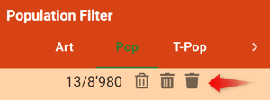
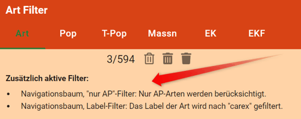

Filtern hat in apflora eine lange Geschichte und wurde Schritt um Schritt erweitert. 
Zuletzt im Juli 2022.  

## Welche Filter gibt es?

### 1. Navigationsbaum, Hierarchie-Filter

Die Position in der aktuellen Navigation beeinflusst den aktuell angewandten Filter.  

Beispiele: 

- Wechseln Sie mit offener Karte und darauf eingeblendeten Populationen von Art zu Art, werden immer deren jeweiligen Populationen angezeigt.
- Wechseln Sie mit offener Karte und darauf eingeblendeten Teil-Populationen von Population zu Population, werden immer deren jeweiligen Teil-Populationen angezeigt.

### 2. Navigationsbaum, Label-Filter

Im Navigationsbaum gibt es oben links den Label-Filter. Er heisst jeweils so, wie die aktive Ebene, z.B. "Arten filtern" oder "Populationen filtern". 
 

Beispiel: 
Erfassen Sie im Label-Filter auf Stufe Art "carex", wird nach den Arten mit dieser Zeichenfolge im Namen gefiltert.  

### 3. Navigationsbaum, nur-AP-Filter

Weil das Anzeigen nur der AP-Arten ein häufiger Vorgang ist (und es früher keine oder-Filterung gab), kann man im Navigationsbaum oben rechts mit einem Klick diesen Filter ein- oder ausschalten. 
  

### 4. Karten-Filter

Auf der Karte kann man im Layer-Tool oben rechts unter `apflora` ein Werkzeug für Karten-Filter einschalten. Danach erscheinen in der Karte oben links Werkzeuge zum Zeichnen eines Umrisses, für dessen Bearbeitung und Löschung. 
 

Ist ein Umriss gezeichnet, wird er auf die Filter der Stufe Population, Teil-Population und Massnahmen angewandt. Es werden also nur noch Populationen/Teil-Populationen/Massnahmen von Teil-Populationen angezeigt, die innerhalb dieses Umrisses liegen.  

### 5. Formular-Filter

Das ist der flexibelste Filter.  

Man öffnet ihn mit der Schaltfläche oben in der Navigationszeile, rechts neben der Daten-Schaltfläche: 

 

Es gibt ihn für diese Formulare:

- Art
- Population
- Teil-Population
- Massnahmen
- Feld-Kontrollen (EK)
- Freiwilligen-Kontrollen (EKF) (nur in der Normal-Ansicht. Freiwillige können das also nicht)

Filter-Formulare entsprechen (fast) genau den normalen Formularen. Sie sind aber orange hinterlegt, damit nicht aus Versehen beim Filtern echte Daten verändert werden. 
 

Erfasst man Werte, wird der Filter nach Verlassen des Feldes oder nach Drücken der Enter-Taste angewandt (bei Auswahl-Feldern sofort).  

Filtern kann man im `Strukturbaum` _und_ im `Strukturbaum 2`. Öffnet man den `Strukturbaum 2`, entspricht er genau dem `Strukturbaum`, d.h. es wird auch ein allfälliger Filter kopiert. Danach sind die Filter unabhängig im jeweiligen Navigationsbaum gültig.  

#### Und-Filter

Erfasst man in einem Filter-Formular in mehreren Feldern Werte, müssen diese gleichzeitig bzw. kummulativ erfüllt sein.  

Beispiel: 

Erfasst man für die Art `Aktionsplan = erstellt` UND `Stand Umsetzung = in Umsetzung`, werden Arten gefiltert, deren Aktionsplan erstellt ist _und_ sich in Umsetzung befindet.  

#### Oder-Filter

Im Formular-Filter gibt es bei Arten, Populationen, Teil-Populationen und Massnahmen nummerierte Register. Und rechts daneben ein (zunächst inaktives) mit `oder` beschriftetes. 
 

Die Nummern nummerieren Kriterien der Oder-Filterung. Sobald in einem Register ein Wert erfasst wurde (oder mehrere, siehe Und-Filter), wird das mit `oder` beschriftete Register aktiv. Klickt man darauf und erfasst darin weitere Werte, hat man eine Oder-Filterung geschaffen. Will heissen: Es wird nach Datensätzen gefiltert, die entweder die Kriterien im Register 1 oder diejenigen im Register 2 erfüllen. Die Anzahl Register bzw. oder-Kriterien ist unbeschränkt.  

Beispiel: 
Will man alle ursprünglichen Populationen, filtert man im Filter-Formular für Populationen nach `ursprünglich, aktuell` oder `ursprünglich, erloschen`.  

## Wo werden Filter angewendet?

- Im Navigationsbaum
- In der Karte (Populationen, Teil-Populationen)
- In einigen Exporten gibt es zwei Befehle: Neben dem normalen, der alle Objekte (abhängig von den Zugriffsrechten) ungefiltert exportiert, einen zusätzlichen der den aktuellen Filter anwendet

## Es gibt so viele Filter. Wie spielen sie zusammen?

Additiv. Will heissen: sie werden alle gleichzeitig angewandt.  

Wenn Sie im Formular-Filter mach mehreren oder-Kriterien filtern, werden alle übrigen Filter bei jedem einzelnen oder-Kriterium additiv d.h. zusätzlich angewandt.  

Das geht sogar so weit, dass Filter von hierarchisch höheren Filtern beeinflusst werden.  

**Beispiel** 
Sie haben folgende Filter gesetzt:

- Im Navigationsbaum-Label-Filter `Art filtern: "carex"`
- Im Navigationsbaum den "nur AP"-Filter eingeschaltet
- Im Filter-Formular für Populationen die Kriterien `Status = "angesiedelt aktuell"` oder `Status = "angesiedelt erloschen"`
- Im Karten-Filter haben Sie den Sie interessierenden Umriss gezeichnet

Resultat: 
Im Navigationsbaum, in der Karte und in den filterbaren Exporten sehen Sie nur noch ursprüngliche Populationen der drei Carex-Arten, für die Aktionspläne bestehen oder vorgesehen sind und die im interessierenden Gebiet liegen. 
 

## Wie werden Filter entfernt?

Im Formular-Filter gibt es oben drei Symbole: 
 

- Mit dem linken Symbol kann man das aktuelle Kriterium der oder-Filterung entfernen (sichtbar als das aktivierte Register)
- Mit dem mittleren Symbol kann man den Filter (alle oder-Kriterien) in der aktiven Ebene entfernen (z.B. Population). Filter in anderen Ebenen bleiben erhalten (z.B. Art)
- Mit dem rechten Symbol kann man alle aktiven Filter entfernen. Das betrifft auch Navigationsbaum-Label-Filter, nur-AP-Filter und Karten-Filter. Nicht aber den hierarchischen Navigationsbaum-Filter - dafür wäre eine Navigation nötig und die könnte Benutzer überraschen bzw. ungewollt sein

## Es gibt so viele Filter. Wie weiss ich, welche aktiv sind?

Sie können natürlich im Navigationsbaum, in der Karte und im Formular-Filter an allen relevanten Orten nachschauen.  

Eine gute Übersicht erhalten Sie aber im Formular-Filter der jeweiligen Ebene. Dort wird aufgelistet, welche der übrigen Filter auf dieser Ebene wirksam sind. 
  
