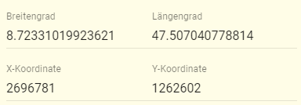

Früher wurden Koordinaten in apflora in der Projektion [LV03](https://www.swisstopo.admin.ch/de/wissen-fakten/geodaesie-vermessung/bezugsrahmen/lokal/lv03.html) erfasst. ca. Anfang 2018 wurde [LV95](https://www.swisstopo.admin.ch/de/wissen-fakten/geodaesie-vermessung/bezugsrahmen/lokal/lv95.html) übernommen.  

Leider mussten wir feststellen, dass LV95 ausserhalb der Schweiz einen deutlich schmaleren Bereich abdeckt als zuvor LV03. So konnten schon im Nahen Deutschland die Koordinaten einiger Teil-Populationen nicht mehr gespeichert werden.  

Darum haben wir am 2.6.2019 auf eine Projektion gewechselt, die weltweit angewandt wird: [WGS84](https://de.wikipedia.org/wiki/World_Geodetic_System_1984) (Längen- und Breitengrade). Und dazu verwenden wir [PostGIS](https://de.wikipedia.org/wiki/PostGIS). Somit sind die GIS-Funktionalitäten von apflora künftig stark ausbaubar.  

In Formularen (Populationen und Teil-Populationen) werden neu beide Projektionen dargestellt:

...und die Daten können auch in beiden verändert werden.  

Bisher ist mir noch keine Karte begegnet, welche den Gültigkeitsbereich von LV95 im Ausland klar abgrenzt. Das ist wohl bewusst so, weil LV95 nur für die Schweiz gedacht ist. **Im Ausland sollte daher künftig grundsätzlich WGS84 verwendet werden**.