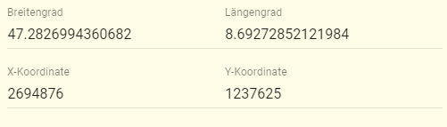

Früher wurden Koordinaten in apflora in der Projektion [LV03](https://www.swisstopo.admin.ch/de/wissen-fakten/geodaesie-vermessung/bezugsrahmen/lokal/lv03.html) erfasst. Vor ca. einem Jahr wurden vom Kanton Zürich und apflora.ch [LV95](https://www.swisstopo.admin.ch/de/wissen-fakten/geodaesie-vermessung/bezugsrahmen/lokal/lv95.html) übernommen.  

Leider mussten wir feststellen, dass LV95 ausserhalb der Schweiz einen deutlich schmaleren Bereich abdeckt. So konnten schon im Nahen Deutschland die Koordinaten einiger Teil-Populationen nicht mehr gespeichert werden.  

Darum haben wir nun auf eine Projektion gewechselt, die weltweit angewandt wird: [WGS84](https://de.wikipedia.org/wiki/World_Geodetic_System_1984) (Längen- und Breitengrade). Und dazu verwenden wir [PostGIS](https://de.wikipedia.org/wiki/PostGIS). apflora.ch ist nun ein eigenes [GIS](https://de.wikipedia.org/wiki/Geoinformationssystem) und künftig diesbezüglich beinahe unbegrenzt ausbaubar.  

In Formularen (Populationen und Teil-Populationen) werden neu beide Projektionen dargestellt:

...und die Daten können auch in beiden verändert werden.