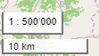

Wurde am 14.09.2018 eingeführt.  

Ihr findet das Massstab-Werkzeug unten links auf der Karte, oberhalb des Werkzeugs, dass eine Distanz anzeigt: 
 

Was kann es?

- Es zeigt immer den ungefähren aktuellen Massstab der Karte an 
  Wieso ungefähr?
    - Es wird der nächste Massstab aus der Auswahlliste angezeigt (siehe unten)
    - Weil der Massstab von sehr vielen Faktoren abhängt (u.a. Tile-Grösse der Hintergrundkarte, geographische Höhe, Bildschirm-Auflösung...) ist er grundsätzlich nicht sehr genau.
    - Plane Kartendarstellungen können grundsätzlich nicht überall denselben Massstab darstellen. Versucht mal, einen aufblasbaren Globus aufzuschneiden und flach auszubreiten :stuck_out_tongue_winking_eye:. 
      Wenn ihr also eine Distanz messen wollt, benutzt dafür das Mess-Werkzeug oben rechts unter dem Layer-Werkzeug: 
      
- Klickt man auf das Massstab-Werkzeug, öffnet sich eine Liste von Massstäben, aus denen man wählen kann 
  
- ...und im untersten Feld kann man einen beliebigen Massstab setzen 
  