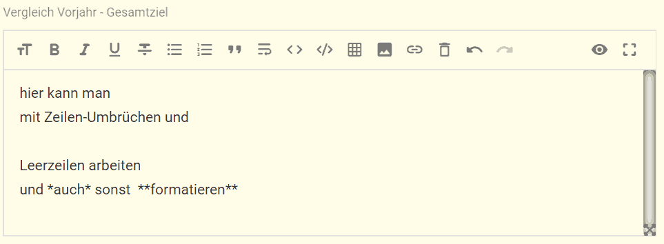

Am 19.04.2020 wurden formatierbare Felder eingeführt: 

Dafür wird ein sogenannter "markdown editor" verwendet.  

In Markdown-Feldern seht ihr nun ein Menüband am oberen Rand des Feldes. Links sind die Formatierungs-Möglichkeiten. Rechts zwei Schaltflächen:

1. Die linke wechselt von Editiermodus zum parallelen Editieren mit Vorschau, zur reinen Vorschau und dann wieder in den reinen Editiermodus. Das ist ein bisschen gewöhnungsbedürftig :stuck_out_tongue_winking_eye:
2. Die rechte ermöglicht euch, beim Schreiben den ganzen Bildschirm zu nutzen

Markdown ist ein reines Text-Format. Daher kann es roh in ein Textfeld einer Datenbank gespeichert werden. Die Daten können sogar weiterhin abfragt bzw. gesucht werden.  

Der Hauptgrund, warum einige Felder Markdown zulassen, ist um Zeilen-Umbrüche und Leer-Zeilen zu ermöglichen.
