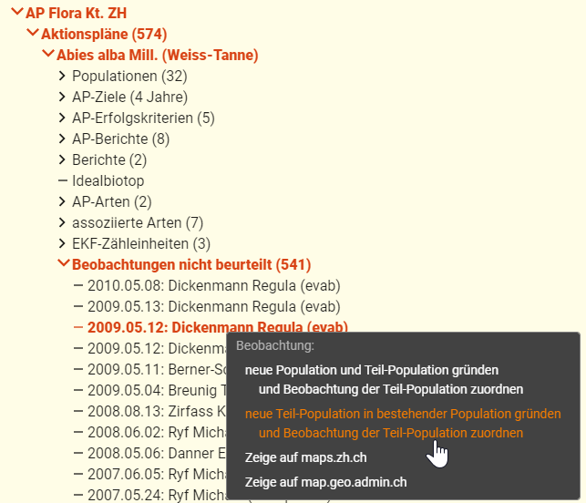

Bei den wichtigsten Artförderprogrammen werden gemeldete Beobachtungen beurteilt. Sie werden entweder verworfen ("nicht zuordnen") oder einer Teilpopulation zugeordnet.  

Verworfen werden Beobachtungen in der Regel, wenn:

- sie nicht (genau genug) lokalisiert werden können oder
- die Artbestimmung (zu) unsicher ist

## 1. So wird's gemacht

### 1.1 Im Formular

1. Art wählen
2. Im Strukturbaum eine nicht beurteilte Beobachtung wählen
3. Im Formular bei "Einer Teilpopulation zuordnen" die gewünschte wählen  

### 1.2 in Karten

Gemäss diesem Video:
`youtube: https://www.youtube.com/watch?v=Oy-TDV37xhI&list=PLTz8Xt5SOQPS-dbvpJ_DrB4-o3k3yj09J&index=8`

### 1.3 Im Strukturbaum

Hier gibt es zwei Methoden, die mit einem einzigen Klick ausgelöst werden können:

- neue Population und Teil-Population gründen und die Beobachtung der neuen Teil-Population zuordnen
- neue Teil-Population in bestehender Population gründen und die Beobachtung der neuen Teil-Population zuordnen. 
  Die gewünschte Population kann aus einer Liste gewählt werden

 

## 2. Verfügbare Beobachtungen

Episodisch und bei Bedarf werden Beobachtungen importiert. Ziel: mindestens ein mal jährlich. Folgende Importe haben bisher stattgefunden:

- 2016: 232'595 von der Fachstelle Naturschutz
- 2017: 192'606 von [Info Spezies](https://www.infoflora.ch/de/allgemeines/info-species.html)
- 2017: 30'935 des Projekts [Floz](https://www.floz.zbg.ch/) (offenbar nur Herbarbelege)
- 2021: 17'638 von [Info Spezies](https://www.infoflora.ch/de/allgemeines/info-species.html) (nur für von Topos ausgewählte Arten)
- 2022.01: 459 von [Info Spezies](https://www.infoflora.ch/de/allgemeines/info-species.html) (von den Art-Verantwortlichen neu erfasste)
- 2022.03: 15'012 von [Info Spezies](https://www.infoflora.ch/de/allgemeines/info-species.html) (nur für von Topos ausgewählte Arten, inklusive von den Art-Verantwortlichen neu erfasste)
- 2022.04: 1'147 von [Info Spezies](https://www.infoflora.ch/de/allgemeines/info-species.html) (von den Art-Verantwortlichen neu erfasste ausserhalb des von der Infoflora mit normalen Exporten gelieferten Gebiets, d.h. mehr als 30km vom Kt. Zürich entfernt)
    
