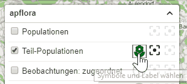
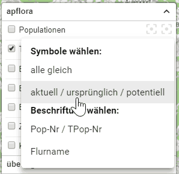
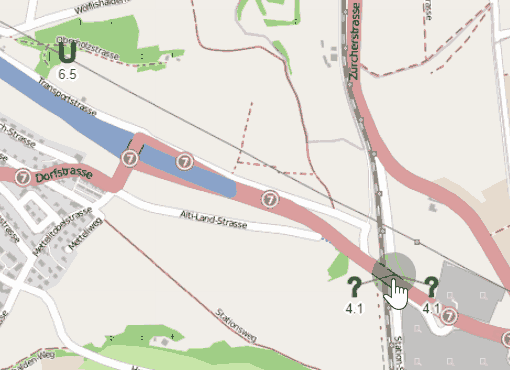

Seit dem 26.12.2018 ist das Blumen-Symbol für Populationen und Teil-Populationen im Layer-Tool der Karte interaktiv: 
 
Klickt man darauf, öffnet sich ein Menü: 
 
Darin kann man wählen, mit welcher Symbolisierung und Labels Populationen und Teil-Populationen angezeigt werden.

Aktuell stehen zur Verfügung:  

#### Symbole:

- alle Populationen/Teil-Populationen gleich (wie bisher)
- Populationen/Teil-Populationen nach Statusgruppen unterschieden:
  - ursprünglich: U
  - angesät: A
  - potentiell: P
  - ohne Status: ?

 

#### Label:

- Nr. (Populationen) bzw. Pop-Nr./Tpop-Nr. (Teil-Populationen)
- Name (Populationen) bzw. Flurname (Teil-Populationen)
