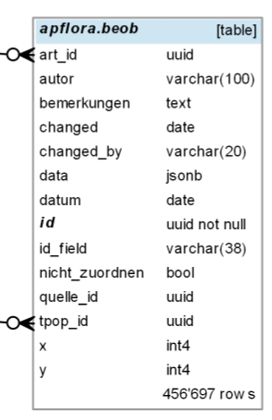

## 1. Datenstruktur

Beobachtungen werden in der Tabelle `beob` gespeichert: 
 

Ein Datensatz besteht aus jeweils zwei Teilen:

1. Den unveränderten Originaldaten der Beobachtung, enthalten im JSONB-Feld `data`
2. Extrahierten bzw. abgeleiteteten Daten, welche für das effiziente Funktionieren von apflora.ch benötigt werden, in den übrigen Feldern

Zur Extraktion der Originaldaten aus EvAB wird die in EvAB enthaltene Abfrage `vExportZDSF` verwendet. Daten von Info Spezies werden in derjenigen Struktur importiert, wie sie von der FNS aufbereitet wurden.  

Zweck dieser Datenstruktur: 
* Die Struktur von Beobachtungsdaten ist im Prinzip unerheblich. Änderungen daran auch nicht. Wichtig ist einzig, dass zum Zeitpunkt des Imports klar ist, wie aus den Beobachtungsdaten die abgeleiteten Felder in Tabelle `beob` generiert werden können
* Somit können jederzeit Beobachtungen unabhängig von ihrer Datenstruktur importiert werden
* Schon vorhandene Beobachtungen können bei erneutem Import mit aktuelleren ersetzt werden (`quelle_id` und `id_field` vergleichen)
* Mit Hilfe der abgeleiteten Felder können gebaut werden:
  * der Strukturbaum
  * das Beobachtungs-Formular
  * die Funktion für Meldungen an Info Spezies

Struktur der Tabelle "beob":
* id: id dieser Tabelle. Ohne Bezug zu id's in den Beobachtungsdaten
* data: Unveränderte Originaldaten im JSONB Format
* id_field: Feld in den Originaldaten, welches die Original-ID enthält. Dient dazu, gemeinsam mit dem Feld `quelle_id` jederzeit mit neuen Versionen von Originaldaten verbinden zu können
* quelle_id: Woher die Beobachtung stammt (z.B. Info Spezies). Fremdschlüssel aus der Tabelle `beob_quelle_werte`
* art_id: beschreibt die Art. Fremdschlüssel aus Tabelle `ae_eigenschaften`
* art_id_original: Am Unterschied zwischen art_id_original und art_id wird erkenntlich, wenn die Art-Bestimmung verändert wurde
* autor: Autor der Beobachtung
* datum: Datum der Beobachtung
* tpop_id: dieser Teilpopulation wird die Beobachtung zugeordnet
* nicht_zuordnen: Ja oder nein. Wird ja gesetzt, wenn eine Beobachtung keiner Teilpopulation zugeordnet werden kann. Sollte im Bemerkungsfeld begründet werden. In der Regel ist die Artbestimmung zweifelhaft. Oder die Beobachtung ist nicht (genau genug) lokalisierbar
* bemerkungen: Bemerkungen zur Zuordnung
* changed, changed_by: Dokumentiert die letzte Änderung am Datensatz

## 2. Beobachtungen aus EvAB bereitstellen

Beobachtungen aus [EvAB-GeoDB's](http://www.aln.zh.ch/internet/baudirektion/aln/de/naturschutz/naturschutzdaten/tools/evab.html#a-content) müssen mit Hilfe einer Access-Anwendung bereitgestellt werden.  

Mit Hilfe des in EvAB enthaltenen View "vExportZDSF" wird die Tabelle erstellt, die importiert wird. Wichtig: Dabei werden im GUID (NO_NOTE_PROJET) die von Access gesetzten geschweiften Klammern entfernt, z.B. in der Tabellenerstellungsabfrage mit: `NO_NOTE_PROJET: Teil([NO_NOTE_PROJET];2;36)`  

## 3. Beobachtungen der Info Spezies bereitstellen
(Dieser Abschnitt ist vermutlich teilweise veraltet. TODO: beim nächsten Import genauer beschreiben)  

geht so:

1. aus der neuen "beob_infospezies" noch in Access alle von der FNS stammenden (und daher im EvAB-Master enthaltenen) Beobachtungen löschen: 
    `DELETE FROM beob_infospezies WHERE ZH_GUID is not null`
    
1. Neue und alte Beobachtungen vergleichen: Gibt es alte, die in den neuen nicht mehr vorkommen? Wenn ja: Wieso? Es kann z.B. sein, dass Beobachtungen im Umfeld des Kt. Zürich bei einer Lieferung nicht mit geliefert wurden! Müssen diese alten behalten werden? Wurden solche Beobachtungen schon Teilpopulationen zugewiesen oder verworfen? Falls ja: Diese Beobachtungen in separate Tabelle auslagern und nach dem Import wieder anfügen

1. Beobachtungen aus apflora.ch selbst NICHT importieren (bisher waren die offenbar noch nicht enthalten)

