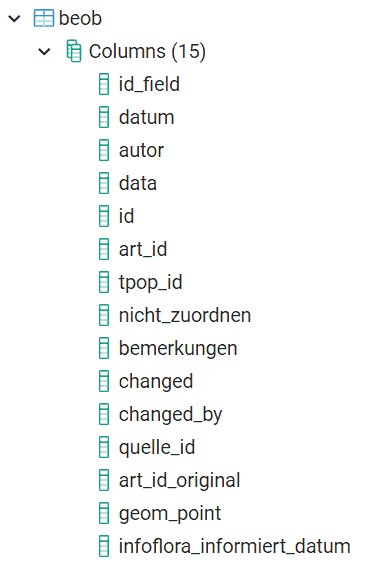

## 1. Datenstruktur

Beobachtungen werden in der Tabelle `beob` gespeichert: 
 

Ein Datensatz besteht aus jeweils zwei Teilen:

1. Den unveränderten Originaldaten der Beobachtung, enthalten im JSONB-Feld `data`
2. In den übrigen Feldern: Extrahierten bzw. abgeleiteteten Daten, welche für das effiziente Funktionieren von apflora.ch benötigt werden

Daten von Info Spezies werden in derjenigen Struktur importiert, wie sie von der FNS aufbereitet wurden.  

Zweck dieser Datenstruktur:

- Die Struktur von Beobachtungsdaten ist im Prinzip unerheblich. Änderungen daran auch. Wichtig ist einzig, dass zum Zeitpunkt des Imports klar ist, wie aus den Beobachtungsdaten die abgeleiteten Felder in Tabelle `beob` generiert werden können
- Somit können jederzeit Beobachtungen unabhängig von ihrer Datenstruktur importiert werden
- Schon vorhandene Beobachtungen können bei erneutem Import mit aktuelleren ersetzt werden (`quelle` und `id_field` vergleichen)
- Mit Hilfe der abgeleiteten Felder können gebaut werden:
  - der Strukturbaum
  - das Beobachtungs-Formular
  - die Funktion für Meldungen an Info Spezies

Struktur der Tabelle "beob":

- id: id dieser Tabelle. Ohne Bezug zu id's in den Beobachtungsdaten
- data: Unveränderte Originaldaten im JSONB Format
- id_field: Feld in den Originaldaten, welches die Original-ID enthält. Dient dazu, gemeinsam mit dem Feld `quelle` jederzeit mit neuen Versionen von Originaldaten verbinden zu können
- obs_id: Wie id_field. Weil ab 2022 Importe sowieso nur von Info Flora stammen sollen, dies ihre ID ist und komplexe Abfragen beim Import mit Hilfe dieses Feldes vereinfacht und beschleunigt werden
- quelle: Woher die Beobachtung stammt. Möglichst kurz und klar, ähnlich Literaturzitaten. Beispiel: Info Spezies 2017
- art_id: beschreibt die Art. Fremdschlüssel aus Tabelle `ae_taxonomies`
- art_id_original: Am Unterschied zwischen art_id_original und art_id wird erkenntlich, wenn die Art-Bestimmung verändert wurde
- autor: Autor der Beobachtung
- datum: Datum der Beobachtung
- geom_point: Die Geometrie der Beobachtung
- tpop_id: dieser Teilpopulation wird die Beobachtung zugeordnet
- nicht_zuordnen: Ja oder nein. Wird ja gesetzt, wenn eine Beobachtung keiner Teilpopulation zugeordnet werden kann. Sollte im Bemerkungsfeld begründet werden. In der Regel ist die Artbestimmung zweifelhaft. Oder die Beobachtung ist nicht (genau genug) lokalisierbar
- bemerkungen: Bemerkungen zur Zuordnung
- infoflora_informiert_datum: Wann ein Email an Info Flora generiert wurde
- created_at, update_at, changed_by: Dokumentiert die letzte Änderung am Datensatz

## 2. Beobachtungen von Info Spezies importieren

Ist in der jeweils aktuellsten Abfrage dokumentiert. Beispiel: https://github.com/barbalex/apf2/blob/master/sql/apflora/import_info_flora/2022-03-30_import_info_flora.sql
